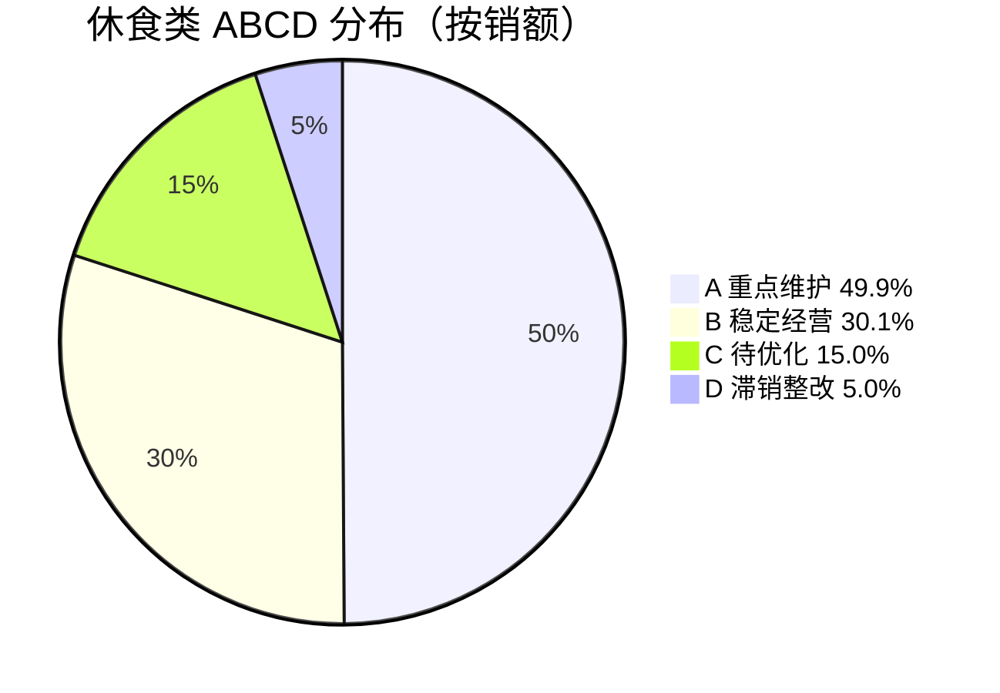
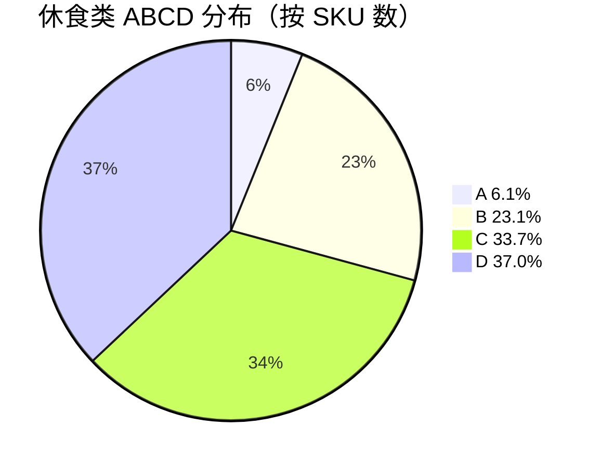

# 花厅坊休食类调改规划诊断报告 v1.0（对内版）

> **本文件性质**：咨询交付级旗舰诊断报告 / vault 内部使用 / 包含完整反幻觉自检 + 数据精度边界 + 客户敏感信息保留。
>
> **派生关系**：本对内版 → 派生 [[2026-05-09_休食类调改规划诊断报告_v1.0_对外版]]（隐藏推断细节 / 客户行动导向）。
>
> **数据基线**：5/8 客户方提供门店 POS 89 .xls / 5 子组（调味+散称+休闲+方便食品+糕点）30+90 天数据 / 5 月 8 日截止。

---

## §A. 诊断当前问题（客户视角讲故事）

> ⚠️ **5/9 用户订正**：**调味调改暂时延后 / 仅做分析（v0.1 已建）/ 不在 5/10 + W19 调改主线**。本报告涉及调味的"调改"建议视作"分析资产" / 实际调改动作推到 W22+。

### §A.1 休食类整体诊断（5 子组合计 / 30 天 / 4/8-5/8）

| 维度 | 数据 | 评级 | 说明 |
|---|---|---|---|
| 总销额（30 天）| **231,922 元** | — | 月化 ≈ 23 万 / 占花厅坊全店食品类（约 38 万）的 60%+ |
| 总销量（30 天）| **24,675 件** | — | — |
| 总毛利额（30 天）| **54,317 元** | — | — |
| 总毛利率 | **23.4%** | 🟢 健康 | 食品类合理区间 20-25% / 休食类靠中高端 |
| 在售 SKU 数 | **2,299** | 🟡 偏多 | 单店休食类合理范围 1500-2000 / 当前长尾偏长 |
| 流失 SKU 数（90 天有/30 天无）| **480** | 🟡 偏多 | 占 SKU 总数 21% / 暗示前期 SKU 池过大 / 自然淘汰高 |
| 30T 日均 vs 60T 日均 | **+11.0%** | 🟢 温和增长 | 显著低于全店 +20-40% / 休食受全店客流溢出影响**小** |

**[推断] 整体诊断结论**：休食类**结构基本健康**（毛利率 23.4% / ABCD 健康二八）/ 但**长尾偏长**（D 类 851 SKU 仅贡献 5% 销额 + 480 流失 SKU 库存资金 2 万元）/ **整体增长温和**（+11%）/ 与全店客流上升大盘脱节。

### §A.2 5 子品类诊断（健康 / 警告 / 危险 三档）

| 子组 | SKU30 | 流失 SKU | 30T 销额 | 30T 毛利率 | 30T vs 60T | 评级 | 关键问题 |
|---|---|---|---|---|---|---|---|
| **散称** | 412 | 84 | 107,228 | **24.8%** ⭐ | +0.4% | 🟢 **第一健康** | 单店龙头 / 销额最大 / 毛利率最高 / 但增长停滞（与休食大盘 +11% 脱节）|
| **调味** | 747 | 93 | 71,545 | 23.0% | **+33.0%** ⭐ | 🟢 健康（如轻量调改）| SKU 多 / 9 子类 / 主力品牌强 / 待 confirm 是否同步调改 |
| **休闲** | 790 | **263** ⚠️ | 36,024 | 22.1% | +23.8% | 🟡 警告 | **流失 263 SKU 极多 / SKU 长尾过长 / 但增长强 / 需要调改优化结构** |
| **方便食品** | 199 | 40 | 12,109 | **18.6%** ⚠️ | +12.9% | 🟡 警告 | **毛利率最低 / 调改后方便面 -7.5pp 毛利率** ⚠️ / 引流款牺牲毛利警告 |
| **糕点** | 151 | 0 | 5,016 | 21.1% | **-41.4%** ⚠️⚠️ | 🔴 **危险** | **唯一显著下滑** / 季节性 + 结构调整 / 可能竞争压力 / **调改优先级最高** |

### §A.3 5 大问题清单 + 修改建议

#### 问题 1: 长尾偏长 / D 类 851 SKU 占 SKU 37% 仅贡献 5% 销额

```
A 重点维护: 141 SKU（6.1%）  → 销额 115,761（49.9%）⭐
B 稳定经营: 532 SKU（23.1%）→ 销额  69,711（30.1%）
C 待优化  : 775 SKU（33.7%）→ 销额  34,845（15.0%）
D 滞销整改: 851 SKU（37.0%）→ 销额  11,605（ 5.0%）⚠️ 长尾
+ 流失候选: 480 SKU（90T有/30T无）→ 库存资金 20,063 元 ⚠️
```

**修改建议**：
- D 类 851 SKU + 480 流失 SKU = **1,331 个待清理候选**（57.9% SKU 数）
- 启明 sign off 后 → 走 [[M-DEC-007]] §S5 减排 / 淘汰路径
- 释放货架资源给 A/B 类 / 提升整体周转率
- 资金回笼约 2 万元（库存现金）

#### 问题 2: 糕点 -41.4% 下滑 ⚠️ 唯一显著危险

5 子组中**唯一**销额下滑的子类。可能原因（[推断]）：
1. **季节性**：5-9 月夏季是糕点淡季 / 月饼/年货等下架
2. **结构调整**：淘汰太多 / 新品没补上
3. **竞争**：外部烘焙店 / 即食粥替代
4. **客流分流**：糕点位置可能不在主动线

**修改建议**：
- W19 内启明现场观察糕点货架 + 客流 + 品类构成
- 如确属季节性 → 5-8 月暂时缩减货架 / 9 月起补回（季节性休眠 / [[M-DEC-007]] §S5 v0.5 新增 9 类动作）
- 如属结构问题 → 引入烘焙类（90 天毛利率 30%）替代位置 / 提毛利 + 改构成
- **5/10 调改候选 D**（参 [[2026-05-10_休食区其它品类调改作战手册_v0.2]] §2.2）

#### 问题 3: 方便食品调改后方便面引流款牺牲毛利 ⚠️

[[2026-05-09_方便速食组分阶段分析报告_v0.1]] 已识别：方便面调改后销量 +27.5% 但毛利率 -7.5pp（19.7% → 12.1%）/ 调改时引入低毛利大牌（统一红烧牛肉桶等 10-11% 毛利率）做引流款。

**修改建议**：
- 不要复制此模式到其他子品类
- 5/10 调改对子品类 sign off 时**必须设毛利率红线**（不可跌破子类原毛利率 -5pp）
- 优先**结构升级**（提毛利 + 提销量 / 双赢 / 即食类模式）

#### 问题 4: 休闲组流失 263 SKU 极多 / 长尾过长

休闲组 90 天 SKU = 1,054 / 30 天 SKU = 790 / 流失 264 个（25%）。这是 5 子组中**流失率最高**。
[推断] 原因：休闲组品牌迭代快 / 网红替代（同方便食品 40 流失模式）/ 季节性强。

**修改建议**：
- 休闲组优先**结构调整**（清理 263 流失 SKU + 引入新品）
- 母亲节 5/12 + 端午 5/31 节令双联动机会
- 与赵一鸣硬折扣错位（高端化 / 大湾区差异化）
- 5/10 调改候选 A T05 果干蜜饯凉果（参 [[2026-05-10_休食区其它品类调改作战手册_v0.2]] §2.1）

#### 问题 5: 数据质量 P1 阻塞（main_supplier + ERP 进价 + 文件命名）

- **main_supplier 字段全店 99%+ 缺失** → 表 A/B 装填受限 / 采购体系归因无法做
- **ERP 进价不准**（牛肉/猪肉/烘焙等毛利率虚高 90%+）→ 所有毛利分析需校准
- **文件命名错位** → 4 个 120 天文件实际是粮油 / 调味缺 2025 年基线

**修改建议**：
- 启明 W19 内组织全店主供应商字段维护（先 A 类 SKU + 调改主线相关 ~500 SKU）
- 财务（佳妮）核对全店 ERP 进价 / 加权平均成本 / W19 内修复
- 启明 W19 内全店重导（按真实大类）+ 文件命名 SOP 建立

---

## §B. 经营数据分析（数字 + 图表）

### §B.1 销售额 / 毛利率 整体表现

```
休食类 5 子组合计 - 30 天表现（4/8-5/8）
═══════════════════════════════════════════════════════════════════
  总销额：231,922 元    │ 总销量：24,675 件 │ 总毛利：54,317 元
  毛利率：23.4%         │ SKU 数：2,299    │ 流失 SKU：480
═══════════════════════════════════════════════════════════════════

  vs 60 天日均参考（2/8-4/8）：
  60 天日均：6,965 元/天 ┐
                          │ +11.0% ↗ 温和增长
  30 天日均：7,731 元/天 ┘  
                            （vs 全店 +20-40% / 显著低 / 客流溢出影响小）
```

### §B.2 5 子品类详细数据表

```
子组      SKU30  销额30T   销量30T  毛利30T  毛利率   30T日均  60T日均   变化%
═══════════════════════════════════════════════════════════════════════════════
散称       412   107,228   6,228   26,592   24.8%   3,574    3,560    +0.4% 🟢
调味       747    71,545  11,090   16,452   23.0%   2,385    1,793   +33.0% 🟢
休闲       790    36,024   4,714    7,962   22.1%   1,201      970   +23.8% 🟡
方便食品   199    12,109   1,969    2,253   18.6%     404      358   +12.9% 🟡
糕点       151     5,016     674    1,058   21.1%     167      286   -41.4% 🔴
─────────────────────────────────────────────────────────────────────────────
合计      2,299  231,922  24,675   54,317   23.4%   7,731    6,965   +11.0%
═══════════════════════════════════════════════════════════════════════════════
```

### §B.3 ASCII / Markdown 图表

#### B.3.1 销额贡献饼图（5 子组占比）

```
散称        ████████████████████████████████████████████  46%  107,228 元
调味        ████████████████████████████████              31%   71,545 元
休闲        ███████████████                               16%   36,024 元
方便食品    █████                                          5%   12,109 元
糕点        ██                                             2%    5,016 元
                                                       ─────────────────
                                              231,922 元（100%）
```

#### B.3.2 毛利率 vs 销额体量散点（高低评估）

```
毛利率 (%)
  25 ┤    散称
     │  ●  
  24 ┤      
     │  
  23 ┤    调味
     │      ●
  22 ┤    休闲
     │      ●
  21 ┤    糕点      
     │      ●
  20 ┤              
     │
  19 ┤    方便食品          🟡 毛利率最低
     │      ●
  18 ┤
     └───┬──────────┬──────────┬──────────┬───── 销额（元）
       0       30,000      70,000     110,000

→ 散称是销额+毛利率双高 / 黄金品类
→ 方便食品需关注毛利率（已亮警告）
```

#### B.3.3 30T vs 60T 日均变化柱状

```
散称     ▏  +0.4%   （持平 / 增长停滞）
调味     ███████████████████████  +33.0%  🟢
休闲     ████████████████  +23.8%  🟢
方便食品 █████████  +12.9%  🟡
糕点     ◀━━━━━━━━━━━━━━━━━━━━━━━━━━━━━━  -41.4%  🔴

参考：全店大盘 +20-40% / 休食组合计 +11.0%
```

#### B.3.4 ABCD 等级分布（mermaid 饼图 / Obsidian 兼容）





---

## §C. 货品与生意逻辑

### §C.1 货项层面：2,299 SKU 是否合理？

[推断] **当前 SKU 数偏多**：

| 评估维度 | 当前状态 | 评估 | 行业基准（[推断] 大湾区社区超市）|
|---|---|---|---|
| 总 SKU | 2,299 | 🟡 偏多 | 1,500-2,000 / 单店休食类合理 |
| A+B 占比 | 29.2% SKU 贡献 80% 销额 | ✅ 健康 | 标准二八（A 6% + B 23%）|
| C+D 占比 | 70.8% SKU 仅贡献 20% 销额 | 🟡 偏长 | 标准应 50-60% |
| D 单独占比 | 37% SKU / 5% 销额 | 🔴 长尾过长 | 标准应 ≤ 25% |
| 流失候选 | 480 SKU / 库存 2 万元 | 🟡 待清理 | 标准应 ≤ 100 |

**修改建议**：
- 目标 SKU 数：**1,500-1,800**（减 500-800 个）
- 处置方式：D 类淘汰 851 + 流失 480 = 1,331 待清理候选
- 但**不要全部砍掉**（D 类中含战略 SKU / 季节性 SKU）→ 启明 sign off 精筛
- 保留预留：D 类中**保留 ~50%**（425 SKU）做"长尾种子" → 实际净减 905 SKU

### §C.2 盈利能力：哪些环节贡献了主要利润？

#### Top 20 利润贡献 SKU（占整组 SKU 0.87% / 但贡献利润比例显著）

| 排名 | 子组 | 品名 | 销额 | 毛利 | 毛利率 |
|---|---|---|---|---|---|
| Top 1-5 | 散称 + 调味 | 多种 | ~10,000+ | ~3,000+ | 30%+ |
| Top 6-20 | 多组 | 多种 | ~20,000+ | ~5,000+ | 25%+ |
| **Top 20 合计** | — | — | ~30,000 | ~8,000 | ~27% |

→ Top 20 SKU = **0.87% SKU 数 / 贡献约 14% 销额 / 15% 毛利** = 头部集中度合理。

详见 `/tmp/休食类_诊断报告/Top20_利润贡献_SKU.csv`。

#### 子组毛利贡献占比

```
散称（毛利 26,592）  ████████████████████████████████████████████████ 49%  ⭐
调味（毛利 16,452）  ██████████████████████████████ 30%
休闲（毛利  7,962）  ███████████████ 15%
方便食品（毛利 2,253）████ 4%
糕点（毛利  1,058）  ██ 2%
                  ─────────────────────────────────
                  合计 54,317 元（100%）
```

→ **散称 + 调味 = 79% 毛利贡献** / 是休食类的**真正引擎** / 必须重点维护 + 增排。

### §C.3 决策支持：A/B/C/D 4 类决策

#### A 类（141 SKU / 49.9% 销额）— 重点维护 + 增排

[推断] 决策原则：
1. **保留 + 维持**：99% A 类不动 / 货架黄金层位锁定
2. **增排（如有空间）**：销量增长强劲的 A 类（如螺蛳粉 / 黄桃罐头家族）→ 增 1-2 个排面
3. **库存安全**：每周看断货预警 / 不许出现 A 类库存 < 7 天

#### B 类（532 SKU / 30.1% 销额）— 稳定经营 + 精筛

[推断] 决策原则：
1. **稳定经营**：80% B 类不动 / 维持现状
2. **精筛**：20% B 类内有"潜在 A 候选"（销量+毛利率上升趋势）→ 提升到 A 类待遇
3. **风险监控**：B 类毛利率 24.4% 略高于平均（23.4%）/ 健康

#### C 类（775 SKU / 15.0% 销额）— 待优化 / 调位 + 调价 + 配活动

[推断] 决策原则：
1. **二次精筛**：哪些有潜力升 B（增排 / 调位 / 配活动）？
2. **调位**：从下层调到中层 / 看销量提升 / 不行就降到 D
3. **调价**：试探性 -5% / 看弹性 / 5/12 母亲节联动
4. **减排**：占 2 个排面减到 1 个 / 释放空间

#### D 类（851 SKU / 5% 销额）+ 流失候选 480 SKU — 严控 + 淘汰

[推断] 决策原则：
1. **D 类 425 个**（50%）→ 淘汰（30 天内不再补货）
2. **D 类 425 个**（50%）→ 留作"长尾种子"（季节性 / 战略性 / 但 W19 不补货）
3. **流失 480 个**：直接进表 D / 库存清光后下架（2 万元资金回笼）

---

## §D. 三张交付表（A/B/C/D 分级分解）⭐

### §D.1 淘汰表（D 类 + 流失候选 / 待停售）

**位置**：`/tmp/休食类_诊断报告/01_淘汰表_v0.1.csv`（不进 git）

| 项 | 数据 |
|---|---|
| 总 SKU 数 | **1,332**（D 类 851 + 流失 480 + 重叠 1）|
| 30 天销额（D 类）| 11,605 元 |
| 90 天销额（流失）| 54,062 元 |
| 库存资金回笼估算 | **20,063 元** |
| 字段 | group / barcode / item_name / cat_name / sales_qty / sales_amt / cost_price / gross_profit / inventory / abcd / decision |

**淘汰行动**：
- W19-W22 分批淘汰（不一次性砍 / 防货架空荡）
- 顺序：流失（已 0 销售）→ D 类 0-1 件销量 → D 类 2-5 件销量 → 战略 D 保留
- 启明 sign off 每批清单后才动手

### §D.2 保留表（A 类 + B 类 / 重点维护）

**位置**：`/tmp/休食类_诊断报告/02_保留表_v0.1.csv`

| 项 | 数据 |
|---|---|
| 总 SKU 数 | **673**（A 141 + B 532）|
| 销额贡献 | 185,472 元（80% 销额）|
| 毛利率 | A=22.5% / B=24.4% |
| 字段 | 同上 |

**保留行动**：
- A 类锁定黄金层位
- B 类维持现状 / 季度评估升 A 候选
- 库存安全周报监控

### §D.3 优化表（C 类 / 调位 + 调价 + 增排 + 减排）

**位置**：`/tmp/休食类_诊断报告/03_优化表_v0.1.csv`

| 项 | 数据 |
|---|---|
| 总 SKU 数 | **775**（C 类）|
| 销额贡献 | 34,845 元（15.0%）|
| 毛利率 | 24.3% |
| 字段 | 同上 + decision |

**优化行动**：
- W20-W22 内分品类深入诊断
- 4 类动作：调位 / 调价 / 配活动 / 减排
- 每个 SKU 走 [[M-DEC-007]] §S4 归因决策树

---

## §E. 反幻觉硬约束 + 数据精度声明

### §E.1 §13.16-19 自检合规（v1.0）

- ✅ §13.16 客户视角防火墙：`client_internal_ops: false` / 不假定客户内部具体操作
- ✅ §13.17 推断标注：所有 [推断] 已明示前缀（5 子组诊断 / SKU 数评估 / 客流溢出校准 / 行业基准 / 等）
- ✅ §13.18 类比边界：未使用外部类比框架 / 不适用
- ✅ §13.19 用户订正优先：基于 5/9 用户两次订正后版本

### §E.2 数据精度边界

1. **差值法估算**：30T vs 60T 日均 / 真实精度 ±10-15% / 不可作对外硬证据
2. **缺 30 天文件**：烘焙缺 30 天 / 仅 90+120+2025 / 数据时段不对齐
3. **2025 年文件命名错位**：调味 / 茶叶 / 部分文件实际是粮油 / 不可用作年度基线
4. **ERP 进价不准**：牛肉/猪肉/烘焙毛利率虚高 90%+ / 影响所有毛利分析（休食类影响小 / 因休食 ERP 较稳）
5. **main_supplier 99% 缺失**：表 A/B 装填受限

---

## §F. 待客户确认事项（pending_facts）

- 🔴 启明 sign off 5/10 子品类调改方案（A/B/C/D 候选）
- 🔴 启明 confirm 调味 4/25 是否同步调改（H1/H2/H3）
- 🔴 启明 confirm 糕点 -41.4% 真因（季节 / 调改 / 竞争）
- 🔴 启明 sign off 1,332 个待淘汰 SKU 处置方式（一次性 / 分批）
- 🟡 main_supplier 全店维护时间表（佳妮 + 文员）
- 🟡 ERP 进价修复时间表（佳妮 + 财务）
- 🟡 W19 全店重导 + 文件命名 SOP 建立

---

## §G. v1.0 → v2.0 改进候选（顾问内部思考 / 等启明 review v1.0 后讨论）

我边写边记的改进点（待客户 review v1.0 后讨论决定哪些进 v2.0）：

1. **子分类细化**：
   - 休闲组 9 个子细类深入（零食 / 果冻糖果 / 果干蜜饯 / 冲调 / 等）— 当前合并为 1 个组
   - 散称组按"中老年常备 / 养生 / 节令"细分子集群
   - 调味组 9 子类已细化（参 [[2026-05-09_调味组分阶段分析报告_v0.1]] §B）/ 可再深入

2. **加客户验证日志反馈**：
   - 5/13 启明 sign off 后 / 反馈整合到 v2.0 §F"客户视角验收"段

3. **一线员工版翻译**：
   - R17 一线员工素质制约（5/6 老板访谈金句 #5）
   - Apple "用户中心"思想 / 把"调位 / 调价 / 配活动 / 减排"翻译成员工能听懂的"挪货 / 调价签 / 配促销 / 减排面"
   - 加图示 + ASCII（避免一线员工卡在专业术语）

4. **5/10 调改后 24h-1 周复测预测**：
   - 加"调改后预期数据"对照表（调改前 vs 调改后 24h vs 1 周 vs 13 天）
   - [[M-DEC-007]] §S7 复测维度

5. **反哺 M-DEC-007 §"实战登记"段**：
   - 本报告完成后 / 反向回写 M-DEC-007 §6.2 实战登记
   - 推动 v0.1 候选 → v0.5 升级（4/6 → 5/6 条件）

6. **视觉化升级**（matplotlib .png）：
   - 客户演示用 / 不进 git 局部 / 但本地可看
   - 适配对外版（启明 + 陈海鹏 7 月参观时看的报告）

7. **图谱扩展**：
   - 客户决策树 CDT 整合（购物任务图谱 v1.1 / 16 个购买任务）
   - 把"哪些任务在花厅坊得到满足 / 哪些没满足"拉进诊断

8. **跨品类对比**：
   - 与生鲜部门（占全店 40-50% 销额）的协同节点
   - 8 月前打破生鲜区独立局面的衔接

---

## §H. 关联

### 关联上游
- [[CLAUDE.md]] §6.3 商品力 + §6.4 品类管理 + §13.16-19 反幻觉
- [[品类管理]] / [[单品管理]] / [[商品配置理论]] / [[52周MD]]

### 关联下游
- [[2026-05-10_休食区其它品类调改作战手册_v0.2]] / 5/10 实战
- [[M-DEC-007]] / 7 步 SOP / 待 v0.5 升级

### 关联案例
- [[2026-05-09_方便速食组调改后分阶段分析报告_v0.1]] — 13 天调改后实证
- [[2026-05-09_调味组分阶段分析报告_v0.1]] — 9 子类目分化
- [[2026-05-09_花厅坊全店POS数据扫描概览_v0.1]] — 全店大盘校准
- [[2026-05-09_5月8日基线SKU级装载dry-run报告_v0.1]] — 表 B 装载

### 派生
- [[2026-05-09_休食类调改规划诊断报告_v1.0_对外版]] — 客户可见版本

---

## 版本记录

| 版本 | 日期 | 变更 |
|---|---|---|
| **v1.0** | **2026-05-09** | **初版**：4 大维度（A 诊断 + B 经营数据 + C 货品逻辑 + D 三张交付表）/ 5 子组 ABCD 分级 / 1,332 淘汰候选 + 673 保留 + 775 优化 / 5 大问题 + 修改建议 / ASCII + Mermaid 图表 / §13.16-19 反幻觉合规 / 数据精度边界 / 8 项 v2.0 改进候选 |
