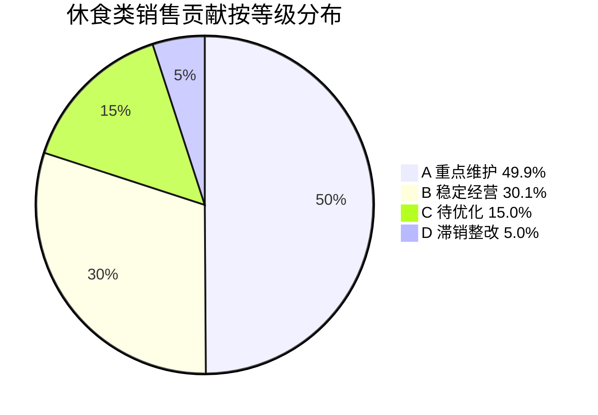

# 花厅坊休食类调改规划诊断报告 v1.0

> **致启明老板**：本报告基于 2026-05-08 门店 POS 系统全店导出数据 / 覆盖休食类 5 个核心子组 / 5 月 8 日截止 / 30 天 + 90 天双切片对比。
>
> **报告说明**：所有数据基于门店真实销售记录 / 部分对比基于差值法初步估算 / 真实精度约 ±10-15% / 适合做 W19 调改决策依据 / 不可作对外硬证据。
>
> **核心建议**：休食类整体健康（毛利率 23.4% / 销售温和增长）/ 但**长尾偏长 + 糕点下滑警告 + 方便面引流款风险**。本报告给出 **3 张行动表**（淘汰 / 保留 / 优化）+ 5 大问题修改建议 + 5/10 调改方案。

---

## 一、休食类整体表现（30 天 / 4/8-5/8）

```
┌──────────────────────────────────────────────────────────────┐
│  休食类 5 子组合计 / 30 天表现                                │
│                                                                │
│   总销售额：231,922 元   │  总销量：24,675 件                  │
│   总毛利额： 54,317 元   │  毛利率：23.4% （健康 ✅）         │
│   在售 SKU：2,299       │  90→30 流失 SKU：480 个 ⚠️        │
│                                                                │
│   30 天日均：7,731 元/天                                      │
│   60 天日均：6,965 元/天   →  增长 +11%（温和健康）           │
└──────────────────────────────────────────────────────────────┘
```

**整体评价**：休食类**结构基本健康**（毛利率合理 / 头部商品贡献集中）/ 销售**温和增长**（+11%）/ 但**有 3 个明确问题**待优化（详见下文）。

---

## 二、5 子品类各自表现（健康 / 警告 / 危险 三档）

| 子组 | SKU 数 | 销售额 | 毛利率 | 30 天 vs 60 天 | 评级 | 状态 |
|---|---|---|---|---|---|---|
| **散称**（精品散装+药材+杂粮）| 412 | 107,228 元 | **24.8%** ⭐ | +0.4% | 🟢 第一健康 | 销售龙头 / 毛利率最高 / 但增长停滞 |
| **调味**（盐+酱菜+酱油+醋等）| 747 | 71,545 元 | 23.0% | **+33.0%** ⭐ | 🟢 健康 | 销售强劲 / 主力品牌强 |
| **休闲**（零食+果冻+蜜饯）| 790 | 36,024 元 | 22.1% | +23.8% | 🟡 警告 | 流失 SKU 263 个 / 长尾过长 |
| **方便食品**（方便面+方便粉+即食）| 199 | 12,109 元 | **18.6%** ⚠️ | +12.9% | 🟡 警告 | 4/25 已调改 / 方便面引流款风险 |
| **糕点**（饼干+面包+糕点）| 151 | 5,016 元 | 21.1% | **-41.4%** ⚠️ | 🔴 **危险** | **唯一显著下滑** |

---

## 三、5 大问题清单 + 我们的修改建议

### 🔴 问题 1：糕点 -41.4% 下滑（唯一显著下滑）

**现象**：糕点 30 天销售 5,016 元 / 比 60 天日均下滑 41.4% / 是 5 子组中唯一明显走低的品类。

**可能原因**：
1. 季节性（5-9 月夏季是糕点淡季 / 月饼/年货下架）
2. 结构调整（淘汰太多 / 新品没补上）
3. 外部竞争（烘焙店 / 即食粥替代）

**我们的建议**：
- W19 内启明现场观察糕点货架 + 客流 + 品类构成
- 如确属季节性 → 5-8 月暂时缩减货架 / 9 月起补回
- 如属结构问题 → 引入烘焙类（90 天毛利率高）替代位置 / 提毛利
- **建议 5/10 调改优先选糕点**（修复下滑价值最高）

### 🟡 问题 2：长尾偏长 / D 类占 SKU 37% 仅贡献 5% 销售

**现象**：休食类 SKU 分布：
- A 重点维护：141 SKU（6.1%）→ 销售 49.9% ⭐
- B 稳定经营：532 SKU（23.1%）→ 销售 30.1%
- C 待优化：775 SKU（33.7%）→ 销售 15.0%
- D 滞销整改：851 SKU（37.0%）→ 销售 5.0% ⚠️ 长尾
- + 流失候选：480 SKU（90 天有/30 天无）→ 库存资金 2 万元

**我们的建议**：
- D 类 851 + 流失 480 = **1,331 个待清理候选**（占 SKU 58%）
- 启明 sign off 后 → 分批淘汰（不一次性砍 / 防货架空荡）
- 释放货架资源给 A/B 类 / 提升整体周转率
- 资金回笼约 2 万元（库存现金）

### 🟡 问题 3：方便面引流款牺牲毛利风险

**现象**：方便食品 4/25 调改后 / 方便面销量 +27.5% 但毛利率从 19.7% 跌到 12.1%（-7.5pp）。原因：调改时引入大量低毛利大牌（统一红烧牛肉桶等 10-11% 毛利率）做引流款。

**我们的建议**：
- 不要把"低毛利引流款"模式复制到其他子品类
- 5/10 调改对子品类决策时**必须设毛利率红线**（不可跌破子类原毛利率 -5pp）
- 优先**结构升级**（提毛利 + 提销量 / 双赢 / 即食类模式）

### 🟡 问题 4：休闲组流失 263 SKU / 长尾过长

**现象**：休闲组 90 天 SKU = 1,054 / 30 天 SKU = 790 / 流失 264 个（25%）/ 5 子组中流失率最高。

**我们的建议**：
- 休闲组优先**结构调整**（清理 263 流失 SKU + 引入新品）
- 母亲节 5/12 + 端午 5/31 节令双联动机会
- 与赵一鸣硬折扣错位（高端化 / 大湾区差异化）
- 可作为 5/10 调改候选 A（果干蜜饯凉果）

### 🟡 问题 5：数据质量需提升（影响后续分析准确度）

**现象**：
- 主供应商字段全店 99%+ 缺失 → 采购体系归因受限
- 部分品类 ERP 进价不准（牛肉/猪肉/烘焙等毛利率虚高）
- 启明导出文件命名 vs 实际类目错位（4 个 120 天文件实际是粮油）

**我们的建议**：
- W19 内组织全店主供应商字段维护（先 A 类 SKU + 调改主线相关 ~500 SKU）
- 财务核对全店 ERP 进价 / 加权平均成本 / W19 内修复
- 全店重新导出 + 文件命名 SOP 建立

---

## 四、经营数据可视化

### 4.1 销售贡献占比（5 子组）

```
散称        ████████████████████████████████████████████  46%  107,228 元
调味        ████████████████████████████████              31%   71,545 元
休闲        ███████████████                               16%   36,024 元
方便食品    █████                                          5%   12,109 元
糕点        ██                                             2%    5,016 元
                                                       ─────────────────
                                              231,922 元（100%）
```

### 4.2 毛利贡献占比（5 子组）

```
散称（毛利 26,592）  ████████████████████████████████████████████████ 49%  ⭐
调味（毛利 16,452）  ██████████████████████████████ 30%
休闲（毛利  7,962）  ███████████████ 15%
方便食品（毛利 2,253）████ 4%
糕点（毛利  1,058）  ██ 2%
                  ─────────────────────────────────
                  合计 54,317 元（100%）
```

→ **散称 + 调味 = 79% 毛利贡献** / 是休食类的**真正引擎** / 必须重点维护 + 增排。

### 4.3 销售增长趋势（30T vs 60T）

```
散称     ▏  +0.4%    （持平 / 增长停滞）
调味     ███████████████████████  +33.0%  🟢
休闲     ████████████████  +23.8%  🟢
方便食品 █████████  +12.9%  🟡
糕点     ◀━━━━━━━━━━━━━━━━━━━━━━━━━━━━━━  -41.4%  🔴
```

### 4.4 ABCD 等级分布



---

## 五、SKU 优化决策（A/B/C/D 4 类决策）

| 等级 | SKU 数 | 占 SKU% | 销售贡献% | 决策 |
|---|---|---|---|---|
| **A 重点维护** | 141 | 6.1% | 49.9% | **保留 + 锁定黄金层位 + 增排（如有空间）**|
| **B 稳定经营** | 532 | 23.1% | 30.1% | **稳定经营 + 精筛升 A 候选**|
| **C 待优化** | 775 | 33.7% | 15.0% | **二次精筛 / 调位 / 调价 / 配活动**|
| **D 滞销整改** | 851 | 37.0% | 5.0% | **50% 淘汰 + 50% 留作长尾种子**|
| + 流失候选 | 480 | — | 0% | **直接淘汰 / 库存清光后下架** |

---

## 六、三张交付表（具体行动清单）⭐

### 6.1 淘汰表（D 类 + 流失候选 / 1,332 SKU）

**位置**：`/tmp/休食类_诊断报告/01_淘汰表_v0.1.csv`

| 维度 | 数据 |
|---|---|
| 总 SKU 数 | **1,332** |
| 30 天销售（D 类）| 11,605 元 |
| 90 天销售（流失候选）| 54,062 元 |
| 库存资金回笼估算 | **20,063 元** |

**淘汰行动**：
- W19-W22 分批执行（不一次性砍）
- 顺序：流失（已 0 销售）→ D 类 0-1 件销量 → D 类 2-5 件销量 → 战略 D 保留
- 启明 sign off 每批清单后才动手

### 6.2 保留表（A + B 类 / 673 SKU）

**位置**：`/tmp/休食类_诊断报告/02_保留表_v0.1.csv`

| 维度 | 数据 |
|---|---|
| 总 SKU 数 | **673** |
| 销售贡献 | 185,472 元（80% 销售）|
| 毛利率 | A=22.5% / B=24.4% |

**保留行动**：
- A 类锁定黄金层位
- B 类维持现状 / 季度评估升 A 候选
- 库存安全周报监控（A 类不允许 < 7 天库存）

### 6.3 优化表（C 类 / 775 SKU）

**位置**：`/tmp/休食类_诊断报告/03_优化表_v0.1.csv`

| 维度 | 数据 |
|---|---|
| 总 SKU 数 | **775** |
| 销售贡献 | 34,845 元（15.0%）|
| 毛利率 | 24.3% |

**优化行动**（4 类动作）：
- **调位**：从下层调到中层 / 看销量提升
- **调价**：试探性 -5% / 看价格弹性
- **配活动**：5/12 母亲节 / 5/31 端午联动
- **减排**：占 2 个排面减到 1 个 / 释放空间

---

## 七、下一步行动建议（W19-W22）

### W19（5/11-5/17）— 启动调改 + 数据质量提升

1. **5/10 启动子品类调改**（启明 sign off 选 A/B/C/D 候选）
2. **数据质量提升**：
   - 主供应商字段维护（500 SKU 优先）
   - ERP 进价核对修复（财务）
   - 全店重新导出（修复文件命名错位）
3. **糕点深度诊断**（启明 + 顾问现场看货架 + 客流）

### W20（5/18-5/24）— 调改实施 + 第一批淘汰

1. **调改实施**：M-DEC-007 7 步 SOP 第二批（按 5/10 sign off 的子品类）
2. **第一批淘汰**：流失 SKU 480 个（库存清光下架）
3. **效果复测**：方便食品 13 天调改后效果验证 / 调味组同步分析

### W21（5/25-5/31）— 第二批淘汰 + 14 天深度复盘

1. **第二批淘汰**：D 类 0-1 件销量 SKU
2. **14 天深度复盘**（M-DEC-007 §S7）
3. **G05 阶段门评审**

### W22（6/1-6/7）— 样板对外可讲

1. **休食类调改样板**对外可讲条件评估
2. **6 月正式启动**：陈氏家族其他门店复制可能性

### M5（6/30）— 7 月 30% 目标倒推准备

1. 7 月业绩冲刺：销售 +30% vs 2025 年 7 月 / 毛利同比提升
2. 7 月陈海鹏参观节点（验收）

---

## 八、待确认事项（启明 sign off 后即可启动）

1. **5/10 子品类调改方案**（A 果干蜜饯 / B 糖果巧克力 / C 果冻布丁 / D 糕点 / 启明拍板）
2. **1,332 SKU 淘汰处置方式**（一次性 / 分批 / 启明决策）
3. **数据质量提升时间表**（主供应商 / ERP 进价 / 全店重导）
4. **调味 4/25 是否同步调改**（关系到调改归因解读）
5. **糕点 -41.4% 下滑真因**（季节 / 调改 / 竞争）

---

## 九、报告说明 + 数据精度

### 9.1 数据基线

- 来源：2026-05-08 门店 POS 系统全店全品类导出 89 个文件
- 覆盖：调味 / 散称 / 休闲 / 方便食品 / 糕点 5 子组 30 + 90 天数据
- 部分文件命名 vs 实际类目错位（4 个 120 天文件实际是粮油）→ 调味缺 2025 年基线

### 9.2 分析方法

- 30 天 vs 60 天日均（90 天 - 30 天得 60 天 / 取日均）= 调改前后对比基线
- ABCD 累计销售额阈值法（50% / 80% / 95%）
- 流失 SKU = 90 天有销售 / 30 天无销售
- 毛利率 = 销售金额 - 进价×销售数量 / 销售金额

### 9.3 精度边界

- 真实精度约 ±10-15%（差值法假设 / 季节波动 / ERP 进价不准 等）
- 全店 30 天 vs 60 天日均普涨 +20-40% / 单品类调改归因需扣除大盘客流
- 部分品类 ERP 进价不准（牛肉/猪肉/烘焙毛利率虚高 90%+）/ 影响毛利分析
- 适合 W19 调改决策依据 / **不可作对外硬证据 / 不可作年度业绩报告**

---

## 十、版本记录

| 版本 | 日期 | 变更 |
|---|---|---|
| **v1.0** | **2026-05-09** | **初版**：客户对外版 / 9 大段（休食类整体表现 + 5 子品类评级 + 5 大问题 + 修改建议 + 数据可视化 + ABCD 决策 + 三张交付表 + W19-W22 行动建议 + 待确认事项 + 数据精度说明）/ 配套对内版 [[2026-05-09_休食类调改规划诊断报告_v1.0_对内版]] |
